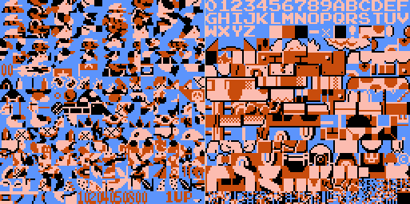
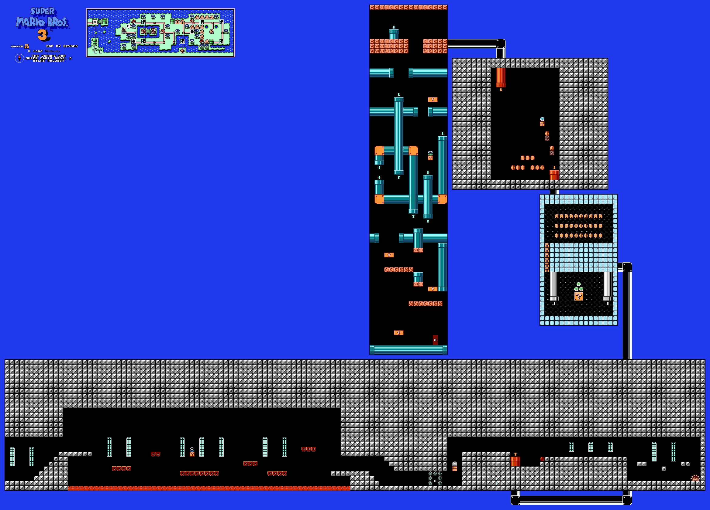
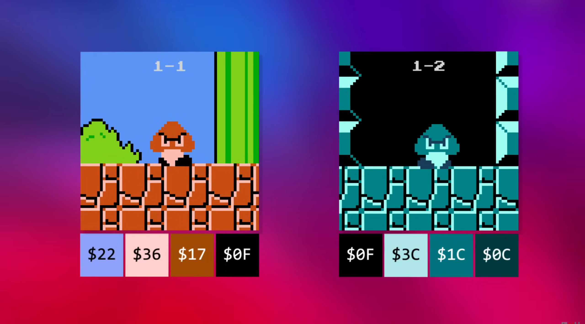

# Little Runner

To play the game, simply run **game.nes** in an NES emulator such as FCEUX.

## Architecture analysis

### CPU

The NES CPU is a Ricoh 2A03 which is based on the MOS technology 6502 8-bit microprocessor. It was manufactured by the company of the same name and also used as a sound chip/secondary CPU in a few Nintendo arcade games.

The 2A03 is quite similar to the 6502, both featuring the 6502 instruction set architecture, three general purpose registers X, Y (for indexes) and A (accumulator), an 8-bit data bus and 16-bit address bus and an 8-bit ALU and stack pointer.
The main difference between the 2 processors is the absence of the Binary-Coded Decimal mode in the 2A03 (replaced by the Audio Processing Unit), meaning that NES developers could not natively perform floating point number calculations without using alternative methods and tricks.

The CPU also has access to 2KB of SRAM (Static RAM) called the WRAM for ‘Work RAM’ which is used to store mutable data for games (score, health…).

### CPU Memory Map

The CPU accesses memory through a fixed address map:

```
$0000–$07FF 2KB internal RAM (WRAM)
$0800–$1FFF Mirrors of $0000–$07FF
$2000–$2007 PPU registers
$2008–$3FFF Mirrors of PPU registers
$4000–$4017 APU and I/O registers
$4018–$401F Disabled / test mode
$4020–$FFFF Cartridge space (PRG-ROM / PRG-RAM)
```

---

### PPU (Picture Processing Unit)

The PPU works alongside the CPU as a co-processor that is tasked to store, process and display sprite graphics. Its function is similar to that of a modern-day GPU. However, unlike the CPU, it cannot be directly programmed, even though it also has its own dedicated 2KB SRAM called the VRAM for ‘Video RAM’. This said memory is divided into 4 main sections.

The first one is the pattern tables, of which there are two. Each of them contains 256 sprite tiles all measuring 8x8 pixels and occupy a total of 64KB. These sprites are used as the basic graphical building blocks for rendering the game components such as the background, characters or objects.

[](https://pikuma.com/blog/game-console-history-for-programmers)

<p align="center">
  <em>Pattern tables for Super Mario Bros. (1985)</em>
</p>

The second one is the nametables, grids of 32x30 tiles taken from the pattern tables used to set-up the game background. The third one is the attribute table which simply maps color maps palettes to 2x2 background tiles ares.

[](https://forums.nesdev.org/viewtopic.php?t=12636)

<p align="center">
  <em>Nametables for Super Mario Bros. 3 (1988)</em>
</p>

The fourth one is the palettes, which can go up to 8 (4 for the background and 4 for the foreground). Color data is not contained in the pattern tables, nor is it in the nametables. Rather, palettes are applied to tiles to color them. The NES is capable of producing 54 different colors, but palettes can only contain 4 at the time, with the first of them being set as a transparent one. This means that every tile from the pattern table can have 3 different colors at the time (excluding transparency). This also allows sprites to be used in a more versatile manner as color can easily be swapped.

[](https://youtu.be/7Co_8dC2zb8?si=y_qEafB4RluErYe6&t=543)

<p align="center">
  <em>Palette comparison between overworld and ground levels in Super Mario Bros. (1985)</em>
</p>

The PPU memory is organized as such:

```asm
$0000–$0FFF  Pattern Table 0 (tiles)
$1000–$1FFF  Pattern Table 1 (tiles)
$2000–$23FF  Nametable 0
$2400–$27FF  Nametable 1
$2800–$2BFF  Nametable 2
$2C00–$2FFF  Nametable 3
$3000–$3EFF  Mirrors
$3F00–$3F1F  Palette RAM
```

The PPU is controlled via registers at $2000–$2007 of the WRAM (CPU side).

- `$2000` — **PPUCTRL** (write): control flags (NMI, pattern tables, etc.)
- `$2001` — **PPUMASK** (write): rendering enable, color settings
- `$2002` — **PPUSTATUS** (read): status flags (VBlank, sprite hit)
- `$2003` — **OAMADDR** (write): set sprite memory index
- `$2004` — **OAMDATA** (read/write): access sprite (OAM) data
- `$2005` — **PPUSCROLL** (write ×2): set scroll (X, Y)
- `$2006` — **PPUADDR** (write ×2): set VRAM address
- `$2007` — **PPUDATA** (read/write): read/write VRAM

```
PPUCTRL ($2000)

7 6 5 4 3 2 1 0
| | | | | | |_
| | | | | | └── Base Nametable (00=$2000, 01=$2400, 02=$2800, 03=$2C00)
| | | | | └──── VRAM Increment (0=+1 how, 1=+32 ver)
| | | | └────── Sprite Pattern Table (0=$0000, 1=$1000)
| | | └──────── Background Pattern Table (0=$0000, 1=$1000)
| | └────────── Sprite Size (0=8x8, 1=8x16)
| └──────────── Unused (always 0 on NES)
└────────────── NMI Enable (0=disabled, 1=enabled)
```

```
PPUMASK ($2001)

7 6 5 4 3 2 1 0
| | | | | | | |
| | | | | | | └── Grayscale (0=normal color, 1=grayscale)
| | | | | | └──── Show background left 8px (0=hide, 1=show)
| | | | | └────── Show sprites left 8px (0=hide, 1=show)
| | | | └──────── Show background (0=off, 1=on)
| | | └────────── Show sprites (0=off, 1=on)
| | └──────────── Color emphasis (red)
| └────────────── Color emphasis (green)
└──────────────── Color emphasis (blue)
```

```
PPUSTATUS ($2002)

7 6 5 4 3 2 1 0
| | | | | | | |
| | | | | | | └── (Unused / stale data)
| | | | | | └──── (Unused / stale data)
| | | | | └────── (Unused / stale data)
| | | | └──────── (Unused / stale data)
| | | └────────── (Unused / stale data)
| | └──────────── Sprite overflow (0=normal, 1=>8 sprites scanline)
| └────────────── Sprite 0 hit (0=no hit, 1=hit)
└──────────────── VBlank (0=not in VBlank, 1=in VBlank)
```

```
OAMADDR ($2003)

7 6 5 4 3 2 1 0
| | | | | | | |
\________________ Address in OAM (0–255)
```

```
OAMDATA ($2004)

7 6 5 4 3 2 1 0

| | | | | | | |
\________________ Data written/read to OAM at current address
```

```
PPUSCROLL ($2005)

First write:
7 6 5 4 3 2 1 0
\________________ X scroll (fine + coarse)

Second write:
7 6 5 4 3 2 1 0
\________________ Y scroll (fine + coarse)
```

```
PPUADDR ($2006)

First write:
7 6 5 4 3 2 1 0
\________________ High byte of VRAM address

Second write:
7 6 5 4 3 2 1 0
\________________ Low byte of VRAM address
```

```
PPUDATA ($2007)

7 6 5 4 3 2 1 0
| | | | | | | |
\________________ Data read/write at VRAM address (auto-increment after access)
```

---


### OAM (Object Attribute Memory)
OAM stores all active sprite data. Each sprite is made of 4 bytes that represent its properties.

- `Byte 0:` — **Y position**
- `Byte 1:` — **Tile index**
- `Byte 2:` — **Attributes**
- `Byte 3:` — **X position**

```asm
7 6 5 4 3 2 1 0
| | | | | | | |
| | | | | | + + → palette (0–3)
| | | | | + - - → unused
| | | | + - - - → priority
| | | + - - - - → flip horizontal
| | + - - - - - → flip vertical
```

### APU (Audio Processing Unit)

The APU handles sound generation. Registers allowing control of the APU are located at $4000–$4015 It is composed of the following channels:

- **2 pulse channels**
- **1 triangle channel**
- **1 noise channel**
- **1 DMC (sample playback)**

```asm
lda #%00110000
sta $4000
```

### Controller Input
NES controllers are made of 8 buttons **_(A, B, Up, Down, Left, Right, Start Select)_**. Upon pressing a button, it closes an electrical circuit within the controller that transmits to the CPU trough the controller port. It is important to note that controller input is read button by button and it is up to the developper to shift every input one by one to make a controller bitmap. The controller output is read via memory address $4016.

```asm
lda #1
sta $4016
lda #0
sta $4016

ldx #8
read_loop:
    lda $4016
    lsr a
    rol buttons
    dex
    bne read_loop
```

### NMI (Non-Maskable Interrupt)

The NMI is an interrupt used for updating graphics and triggering OAM DMA. Its is itself triggered at the start of VBlank (the brief period when the PPU is not rendering the screen, allowing safe updates to graphics memory).

```asm
nmi:
    lda #$00
    sta $2003

    lda #$02
    sta $4014

    inc frame_ready
    rti
```

The rendering pipeline is as follows:


- **Wait for VBlank**
- **Update OAM / VRAM**
- **Let PPU render frame**
- **Repeat**

A typical frame cycle iteration:

- NMI fires
- CPU copies OAM
- Game updates logic
- Player input processed
- Positions updated
- Sprites written to OAM buffer

# 8-bit Console Benchmark: Sega Master System vs Nintendo Entertainment System

| Category | Sega Master System (SMS) | Nintendo Entertainment System (NES) |
|---|---|---|
| CPU | Zilog Z80A @ ~3.58 MHz | Ricoh 2A03 (6502-based) @ ~1.79 MHz |
| System RAM | 8 KB | 2 KB |
| Video RAM (VRAM) | 16 KB | ~2 KB |
| Graphics chip | Sega VDP (custom) | Nintendo PPU (custom) |
| Resolution (typical) | 256×192 (up to 256×224) | 256×240 |
| Color palette | 64 total, 32 on screen | ~52–64 total, ~16 on screen |
| Color usage per tile | Up to 16 colors | Typically 4 colors |
| Sprites (max on screen) | ~32 | Up to 64 |
| Audio chip | SN76489 PSG (3 square + 1 noise), optional FM (JP) | 5 channels (2 pulse, triangle, noise, DPCM) |